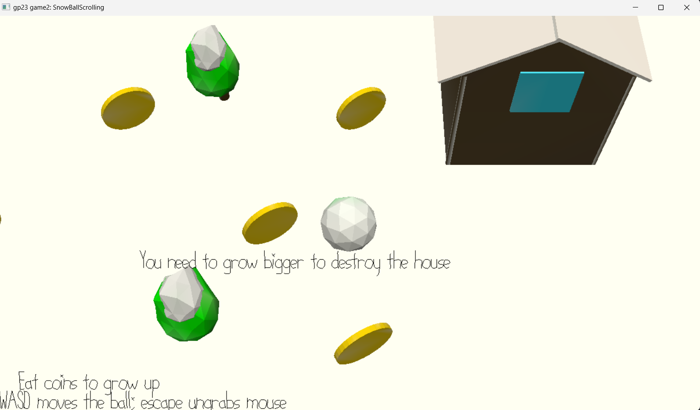

# Snow Ball Scrolling

Author: Yiqu Zhu (yiquz)

Design: the snow ball is greedy and want to go inside the house. It shall eat coins to make itself larger, when it is large enough, he can crush down the wall of the house

Screen Shot:

How To Play:
1. Eat As much Coin as possible to make the snow ball bigger
2. Try to Avoid Tree that will block your way
3. When you get enough coins, you can Crush the House down

This game was built with [NEST](NEST.md).
